# 🤖 Axon Intelligent Automation System

> **Complete Project Automation - No Manual Intervention Required**

## 🎯 Overview

Axon employs a comprehensive **Intelligent Automation System** that manages the entire project lifecycle autonomously, requiring manual intervention only for critical decisions. The system continuously monitors, optimizes, and maintains the project through multiple interconnected workflows.

## 🏗️ Architecture

### Core Automation Components

```mermaid
graph TB
    A[🧠 Intelligent Automation] --> B[🩺 Self-Healing]
    A --> C[🚀 Release Management]
    A --> D[🧪 Test Automation]
    A --> E[⚡ Performance Monitoring]
    A --> F[🔧 Code Optimization]
    A --> G[📦 Maintenance]
    A --> H[📋 Issue Management]
    A --> I[📚 Documentation]
    
    B --> J[Auto-Fix Code Issues]
    B --> K[Update Dependencies]
    B --> L[Heal Failing Tests]
    
    C --> M[Version Detection]
    C --> N[Release Creation]
    C --> O[Changelog Generation]
    
    D --> P[Test Generation]
    D --> Q[Coverage Analysis]
    D --> R[Performance Tracking]
    
    E --> S[Baseline Analysis]
    E --> T[Optimization Application]
    E --> U[Resource Management]
```



### Automation Levels

| Level | Description | Manual Intervention |
|-------|-------------|-------------------|
| 🟢 **Fully Autonomous** | System operates independently | None required |
| 🟡 **Assisted Operation** | System handles most tasks | Approval for major changes |
| 🔴 **Manual Required** | Critical issues detected | Immediate human intervention |

## 🔄 Workflow System

### 1. 🧠 Intelligent Automation & Project Management
**File:** `.github/workflows/intelligent-automation.yml`
**Schedule:** Every hour
**Purpose:** Central intelligence system that orchestrates all other automation

#### Key Features:
- **Project Health Analysis** (100-point scoring system)
- **Smart Optimization Recommendations**
- **Automated Release Trigger Detection**
- **Workflow Self-Optimization**
- **Proactive Issue Monitoring**

#### Automation Modes:
- **Conservative:** Minimal changes, maximum safety
- **Balanced:** Smart optimizations with rollback capability
- **Aggressive:** Proactive improvements and feature additions

### 2. 🩺 Self-Healing & Autonomous Maintenance
**File:** `.github/workflows/self-healing.yml`
**Schedule:** Every 6 hours
**Purpose:** Automatic problem detection and resolution

#### Capabilities:
- **Code Compilation Fixes** - Automatically resolves build issues
- **Test Failure Recovery** - Identifies and fixes common test problems
- **Dependency Management** - Updates and verifies package integrity
- **Security Vulnerability Patching** - Applies automatic security fixes
- **Performance Regression Repair** - Detects and addresses performance issues

#### Health Monitoring:
```bash
Health Score Calculation:
- Compilation: 30 points
- Tests: 25 points
- Security: 20 points
- Code Quality: 15 points
- Dependencies: 10 points
```

### 3. 🚀 Intelligent Release Management
**File:** `.github/workflows/intelligent-release.yml`
**Schedule:** Every 6 hours + Label triggers
**Purpose:** Fully automated semantic versioning and release creation

#### Release Triggers:
- **Feature Accumulation** (3+ new features)
- **Bug Fix Collection** (5+ bug fixes)
- **Time-based Releases** (14+ days for patches, 30+ days for minor)
- **Breaking Changes** (immediate major version bump)
- **Manual Approval** (via GitHub labels)

#### Release Process:
1. **Intelligent Version Calculation** - Analyzes commit history
2. **Pre-release Validation** - Comprehensive quality checks
3. **Multi-platform Binary Building** - Linux, macOS, Windows (ARM64 + AMD64)
4. **Automated Changelog Generation** - Categorized by feature/fix/breaking
5. **GitHub Release Creation** - With assets and checksums
6. **Documentation Updates** - Version references and changelogs

### 4. 🧪 Intelligent Test Automation & Self-Healing
**File:** `.github/workflows/test-automation.yml`
**Schedule:** Every 4 hours + Code changes
**Purpose:** Comprehensive test suite management and improvement

#### Test Health Monitoring:
- **Coverage Analysis** (target: 80%+)
- **Missing Test Detection** - Automatically generates test stubs
- **Flaky Test Identification** - Multiple run validation
- **Performance Benchmark Tracking** - Memory and CPU profiling
- **Test Quality Assessment** - Parallel execution, table-driven patterns

#### Self-Healing Features:
- **Test Template Generation** - Creates comprehensive test stubs
- **Benchmark Addition** - Performance monitoring tests
- **Parallel Test Optimization** - Improves test execution speed
- **Coverage Improvement Suggestions** - Actionable recommendations

### 5. ⚡ Performance Monitoring & Resource Management
**File:** `.github/workflows/performance-monitoring.yml`
**Schedule:** Every 8 hours + Performance-critical changes
**Purpose:** Continuous performance optimization and resource management

#### Performance Metrics:
- **Build Performance** - Time, memory, CPU usage
- **Runtime Benchmarks** - Memory allocations, CPU hotspots
- **Binary Size Optimization** - Compressed and uncompressed analysis
- **Dependency Impact** - Performance cost of external packages
- **Concurrency Analysis** - Multi-core performance testing

#### Automatic Optimizations:
- **Build Cache Management** - Intelligent caching strategies
- **Memory Allocation Patterns** - Object pooling recommendations
- **CPU Hotspot Resolution** - Algorithmic improvement suggestions
- **Binary Size Reduction** - Compilation flag optimization

### 6. 🔧 Automated Code Optimization
**File:** `.github/workflows/code-optimization.yml`
**Schedule:** Daily at 3 AM UTC
**Purpose:** Continuous code quality improvement and optimization

#### Optimization Areas:
- **Code Formatting** - Consistent style enforcement
- **Import Organization** - Automatic import management
- **Dead Code Elimination** - Unused code detection and removal
- **Performance Improvements** - Algorithmic optimization suggestions
- **Security Enhancements** - Vulnerability pattern detection

### 7. 📦 Repository Maintenance
**File:** `.github/workflows/maintenance.yml`
**Schedule:** Daily at 2 AM UTC
**Purpose:** Automated repository housekeeping and optimization

#### Maintenance Tasks:
- **Artifact Cleanup** - Removes old build artifacts (30+ days)
- **Cache Management** - Optimizes CI/CD cache usage (7+ days)
- **Label Standardization** - Maintains consistent issue labeling
- **Milestone Management** - Creates and updates project milestones
- **Health Reporting** - Repository status assessment

### 8. 📋 Issue Management
**File:** `.github/workflows/issue-management.yml`
**Schedule:** Triggered by issue/PR events + Daily cleanup
**Purpose:** Intelligent issue and pull request management

#### Automated Actions:
- **Auto-labeling** - Based on title patterns and content analysis
- **Contributor Welcome** - First-time contributor assistance
- **Stale Issue Management** - Automatic cleanup of inactive issues
- **PR Quality Checks** - Conventional commit validation
- **Auto-merge Capability** - For approved dependency updates

### 9. 📚 Documentation
**File:** `.github/workflows/documentation.yml`
**Schedule:** On documentation changes
**Purpose:** Automatic documentation generation and deployment

#### Documentation Features:
- **API Documentation** - Automatic Go doc generation
- **GitHub Pages Deployment** - Live documentation site
- **Changelog Maintenance** - Release note automation
- **README Updates** - Version reference synchronization

## 🎛️ Control Panel

### Manual Triggers

All workflows can be manually triggered with custom parameters:

```yaml
# Intelligent Automation
automation_level: [conservative, balanced, aggressive]
force_optimization: [true, false]

# Self-Healing
healing_mode: [conservative, moderate, aggressive]
emergency_mode: [true, false]

# Release Management
release_type: [auto, patch, minor, major]
skip_validation: [true, false]

# Test Automation
healing_mode: [conservative, moderate, aggressive]
force_generation: [true, false]

# Performance Monitoring
monitoring_depth: [basic, standard, comprehensive]
auto_optimization: [true, false]

# Code Optimization
optimization_level: [light, medium, aggressive]
auto_commit: [true, false]
```

### Emergency Controls

#### 🚨 Emergency Stop
```bash
# Create emergency stop label on any issue
gh issue create --title "🚨 EMERGENCY STOP" --label "emergency,stop-automation"
```

#### 🔄 Force Full System Reset
```bash
# Manual workflow dispatch with reset parameters
gh workflow run intelligent-automation.yml \
  --field automation_level=conservative \
  --field force_optimization=false
```

#### 🩺 Emergency Healing
```bash
# Trigger immediate healing with emergency mode
gh workflow run self-healing.yml \
  --field healing_mode=aggressive \
  --field emergency_mode=true
```

## 📊 Monitoring & Reporting

### Real-time Status Issues

The system maintains several "living documents" as GitHub issues:

- **🧠 Intelligent Automation Status** - Overall system health
- **🧪 Test Status** - Test suite health and coverage
- **🚀 Performance Status** - Performance metrics and trends
- **📦 Dependency Status** - Security and update status

### Artifact Retention

| Type | Retention | Purpose |
|------|-----------|---------|
| Health Reports | 30 days | System monitoring |
| Performance Profiles | 90 days | Trend analysis |
| Test Coverage | 30 days | Quality tracking |
| Release Artifacts | Permanent | Distribution |
| Emergency Reports | 365 days | Incident analysis |

### Notification System

#### Slack Integration (Future)
```yaml
# Add to repository secrets
SLACK_WEBHOOK_URL: "https://hooks.slack.com/..."
SLACK_CHANNEL: "#axon-automation"
```

#### Email Alerts (Future)
```yaml
# Critical issues automatically create email alerts
ALERT_EMAIL: "team@example.com"
EMERGENCY_EMAIL: "emergency@example.com"
```

## 🔒 Security & Safety

### Safeguards

1. **Rollback Protection** - All changes are reversible
2. **Test Validation** - Changes only applied if tests pass
3. **Human Approval Gates** - Critical changes require manual approval
4. **Emergency Stop** - System can be halted immediately
5. **Audit Trail** - All actions are logged and traceable

### Permissions

```yaml
permissions:
  contents: write      # Code changes and releases
  issues: write        # Status updates and reporting
  pull-requests: write # Automated PRs
  actions: write       # Workflow management
  checks: write        # Status checks
  packages: write      # Release publishing
```

### Secret Management

Required secrets for full functionality:
- `GITHUB_TOKEN` - Provided automatically
- `CODECOV_TOKEN` - Code coverage reporting (optional)

## 🚀 Getting Started

### Initial Setup

1. **Enable Workflows**
   ```bash
   # All workflows are enabled by default
   # No additional setup required
   ```

2. **Configure Automation Level**
   ```bash
   # Trigger initial setup
   gh workflow run intelligent-automation.yml \
     --field automation_level=balanced
   ```

3. **Monitor Health**
   ```bash
   # Check automation status
   gh issue list --label "automation-status"
   ```

### Customization

#### Adjust Automation Aggressiveness
Edit workflow files to modify thresholds:

```yaml
# In intelligent-automation.yml
env:
  AUTOMATION_LEVEL: balanced  # conservative|balanced|aggressive
  HEALTH_THRESHOLD: 75        # 0-100 scale
  AUTO_OPTIMIZATION: true     # Enable/disable auto-fixes
```

#### Modify Schedules
```yaml
# Example: Run health checks more frequently
on:
  schedule:
    - cron: '0 */2 * * *'  # Every 2 hours instead of 6
```

## 🎯 Success Metrics

### Automation Effectiveness

- **Uptime:** 99.9% autonomous operation target
- **Issue Resolution:** 80%+ automatically resolved
- **Release Frequency:** Weekly automated releases
- **Test Coverage:** 90%+ maintained automatically
- **Performance:** Zero regression tolerance

### Quality Indicators

- **Health Score:** 85%+ maintained automatically
- **Security Vulnerabilities:** 0 critical, auto-patched
- **Documentation Coverage:** 100% API documentation
- **Dependency Health:** Always up-to-date and secure

## 🔮 Future Enhancements

### Planned Features

1. **AI-Powered Code Generation** - Intelligent feature implementation
2. **Predictive Failure Detection** - ML-based issue prevention
3. **Dynamic Load Testing** - Automatic performance stress testing
4. **Cross-Repository Coordination** - Multi-project automation
5. **Community Integration** - Automated contributor engagement

### Experimental Features

- **Automated Refactoring** - Large-scale code improvements
- **Intelligent Documentation** - AI-generated explanations
- **Performance Prediction** - Future bottleneck identification
- **Security Hardening** - Proactive security improvements

## 📞 Support & Troubleshooting

### Common Issues

#### Automation Not Running
```bash
# Check workflow status
gh run list --workflow=intelligent-automation.yml

# Manually trigger
gh workflow run intelligent-automation.yml
```

#### Health Score Declining
```bash
# Force healing intervention
gh workflow run self-healing.yml --field emergency_mode=true
```

#### False Positive Alerts
```bash
# Adjust thresholds in workflow files
# Or use conservative mode temporarily
gh workflow run intelligent-automation.yml --field automation_level=conservative
```

### Emergency Contacts

For critical issues that automation cannot resolve:

1. **Create Emergency Issue** with `emergency` label
2. **Manual Workflow Intervention** using GitHub CLI
3. **System Override** by disabling specific workflows

---

## 🎉 Conclusion

The Axon Intelligent Automation System represents a fully autonomous development environment where manual intervention is only required for strategic decisions and emergency situations. The system continuously learns, adapts, and improves the project while maintaining high quality standards and security practices.

**The future of software development is here - and it's fully automated.** 🚀

---
*This documentation is automatically maintained by the Intelligent Automation System*
*Last Updated: Generated dynamically*

